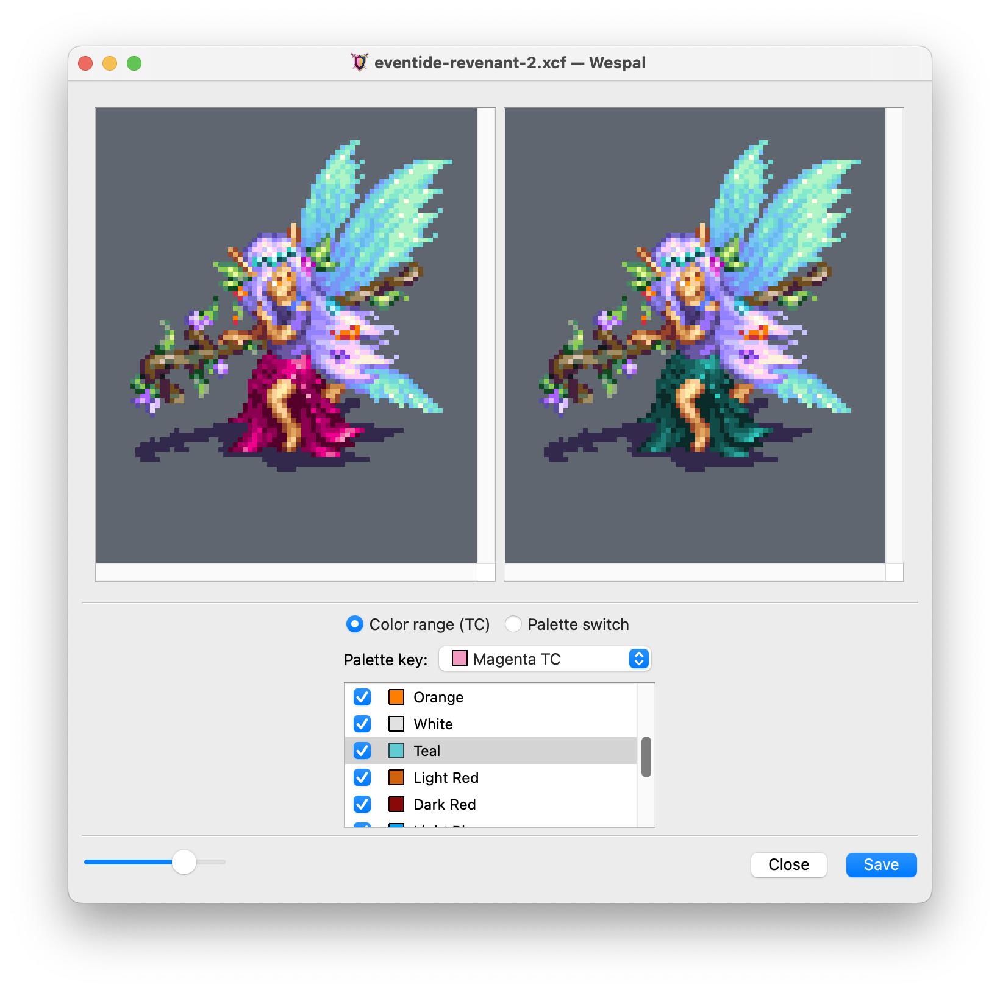

  

Wespal
======

This is a small app which allows [Wesnoth][1] artists and content authors to easily preview graphics as they would be recolored by the game’s unit team coloring system, without needing to run or modify the game itself.

[1]: <https://www.wesnoth.org/>

It provides a simple image preview functionality, as well as the option to save the results to disk for other purposes. A built-in visual palette and color range editor allows artists and coders to play around with the various possibilities offered by Wesnoth’s team coloring and generate WML code for use in add-ons.

License
-------

Wespal as a whole is licensed under the GNU General Public License version 2, or (at your option) any later version — a copy of the GNU GPL version 2 is included in `COPYING`.

[QuaZip][2] is licensed under the GNU Lesser General Public License version 2.1 with a static linking exception. See `src/3rdparty/quazip/COPYING` for details.

[KImageFormats][3] includes code provided under a number of compatible licenses. See `src/3rdparty/kimageformats/licenses/` for the individual licenses.

[2]: <https://github.com/stachenov/quazip>
[3]: <https://api.kde.org/frameworks/kimageformats/html/index.html>

Installing
----------

Windows and macOS users should use the binary packages provided on the [Wespal web page][4] — these support Windows 10 and later, and macOS 11 Big Sur and later. Users on Linux and other platforms should see the `INSTALL.md` file for instructions on building from source.

[4]: <https://irydacea.me/projects/wespal>

### Windows

For Windows users, after extracting the downloaded `.zip` file you can move and run the contained `Wespal.exe` file anywhere.

**The first time you launch a new version of Wespal you may see a warning like this:**

> Windows protected your PC
>
> Windows Defender SmartScreen prevented an unrecognized app from starting.

To add an exception for the app, click on the More Info link, and then click on the newly-revealed Run Anyway button at the bottom.

### macOS

For macOS users, after double-clicking the downloaded `.dmg` file, you can drag Wespal to your Applications folder.

**The first time you launch a new version of Wespal you may see a warning like this:**

> “Wespal” can’t be opened because Apple cannot check it for malicious software.
>
> This software needs to be updated. Contact the developer for more information.

To add an exception for the app, you need to use Finder to browse to the folder where Wespal is installed, and attempt to open it **twice** using right-click + Open. The second time you do this, there will be an Open button underneath the warning, which you can then click on to allow Wespal to launch.

Usage
-----

To start Wespal, just double click the `wespal` executable.

You’ll be presented with an empty main window where you can choose to open an image file. Once you have opened a file, you can preview the effects of various Wesnoth recoloring systems on it. You can also generate pre-recolored copies of the original image file.

Configuration
-------------

The Tools menu allows access to the color range and palette editors, which allow you to define your own color ranges and palette editors for use in Wespal. You can also choose to generate WML code for your custom palettes and ranges, and copy it to clipboard, or simply save it to a file.

Wespal’s configuration, including any created custom palettes and ranges, is stored in a platform-dependent location:

| Platform | Location                                                       |
| -------- | -------------------------------------------------------------- |
| Windows  | `HKEY_CURRENT_USER\Software\Irydacea\Wespal` (in the Registry) |
| macOS    | `$HOME/Library/Preferences/me.irydacea.Wespal.plist`           |
| Linux    | `$HOME/.config/Irydacea/Wespal.conf`                           |

Reporting bugs
--------------

There is an issue tracker on [GitHub][5]. Alternatively, you may post in the [Wesnoth.org forum topic][6].

[5]: https://github.com/irydacea/wespal/issues
[6]: https://r.wesnoth.org/t31965

When reporting a bug, make sure to provide as much relevant information as possible, including your operating system version (e.g. Windows 10 1903) and Wespal version. If you experience issues with a specific image or palette/color range, be sure to provide those as well.
